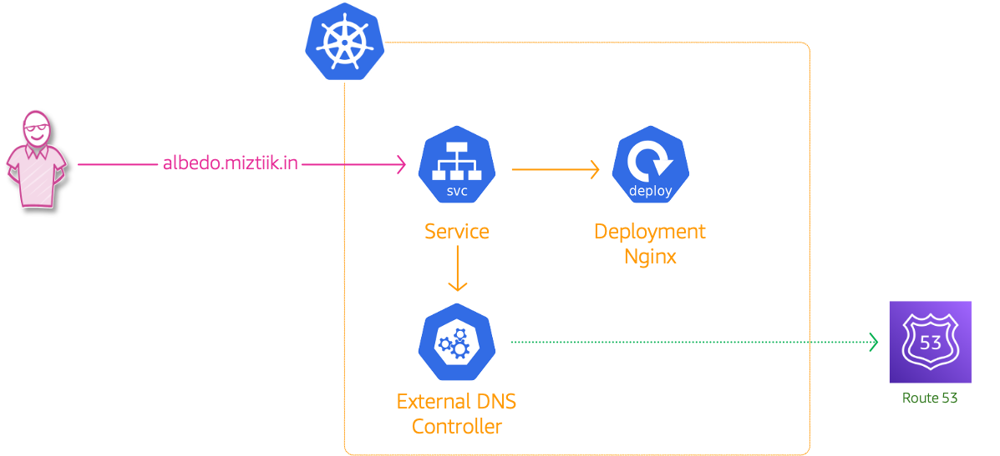
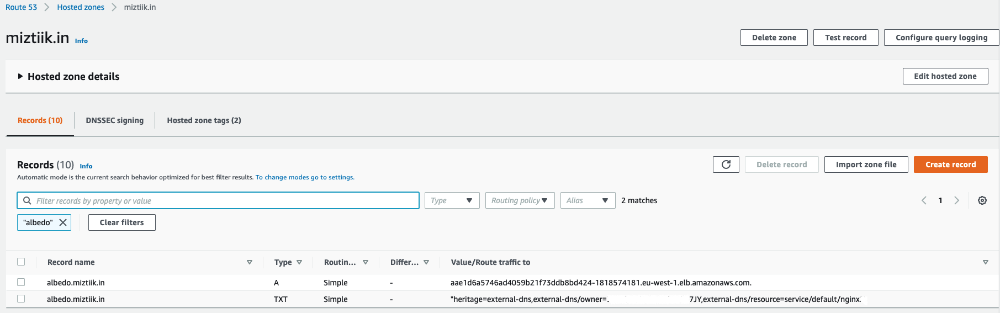

# Kubernetes(EKS) External DNS With Amazon Route 53

The developer at Mystique Unicorn are interested in building their application using event-driven architectural pattern to process streaming data. For those who are unfamiliar, _An event-driven architecture uses events to trigger and communicate between decoupled services and is common in modern applications built with microservices. An event is a change in state, or an update, like an item being placed in a shopping cart on an e-commerce website._

In this application, Kubernetes has been chosen as the platform to host their application producing and consuming events. The would like to have the ability to add a DNS-record on the AWS Route53 when a new service is deployed and point this record to the URL of an load balancer.

Can you help them?

## 🎯 Solutions

**How does external DNS work?**
External DNS<sup>[1]</sup> is a pod running in your cluster which watches over all your ingresses. When it detects an ingress with a host specified, it automatically picks up the hostname as well as the endpoint and creates a record for that resource in Route53. If the host is changed or deleted, external DNS will reflect the change immediately in Route53.

We need to provision external DNS pod with permissions to create interact with Route53. We can configure a service account and annotate it with the AWS IAM Role to give the necessary privileges. The DNS service also needs to know which domain(say example.com or myunicorn.com ) and AWS Route 53 hosted zone to configure records.

In this blog, I will show how to deploy external dns for your kubernetes cluster. I already have public domain(`miztiik.in`) with hosted zone configured in AWS Route53. I will configure external dns to create records on this domain.

You will **need** a public domain name with a hosted zone to follow along this blog.



1. ## 🧰 Prerequisites

   This demo, instructions, scripts and cloudformation template is designed to be run in `us-east-1`. With few modifications you can try it out in other regions as well(_Not covered here_).

   - 🛠 AWS CLI Installed & Configured - [Get help here](https://youtu.be/TPyyfmQte0U)
   - 🛠 AWS CDK Installed & Configured - [Get help here](https://www.youtube.com/watch?v=MKwxpszw0Rc)
   - 🛠 Python Packages, _Change the below commands to suit your OS, the following is written for amzn linux 2_
     - Python3 - `yum install -y python3`
     - Python Pip - `yum install -y python-pip`
     - Virtualenv - `pip3 install virtualenv`

1. ## ⚙️ Setting up the environment

   - Get the application code

     ```bash
     git clone https://github.com/miztiik/eks-external-dns-with-route53
     cd eks-external-dns-with-route53
     ```

1. ## 🚀 Prepare the dev environment to run AWS CDK

   We will use `cdk` to make our deployments easier. Lets go ahead and install the necessary components.

   ```bash
   # You should have npm pre-installed
   # If you DONT have cdk installed
   npm install -g aws-cdk

   # Make sure you in root directory
   python3 -m venv .venv
   source .venv/bin/activate
   pip3 install -r requirements.txt
   ```

   The very first time you deploy an AWS CDK app into an environment _(account/region)_, you’ll need to install a `bootstrap stack`, Otherwise just go ahead and deploy using `cdk deploy`.

   ```bash
   cdk bootstrap
   cdk ls
   # Follow on screen prompts
   ```

   You should see an output of the available stacks,

   ```bash
   eks-cluster-vpc-stack
   eks-cluster-stack
   ssm-agent-installer-daemonset-stack
   eks-external-dns-stack
   ```

1. ## 🚀 Deploying the application

   Let us walk through each of the stacks,

   - **Stack: eks-cluster-vpc-stack**
     To host our EKS cluster we need a custom VPC. This stack will build a multi-az VPC with the following attributes,

     - **VPC**:
       - 2-AZ Subnets with Public, Private and Isolated Subnets.
       - 1 NAT GW for internet access from private subnets

     Initiate the deployment with the following command,

     ```bash
     cdk deploy eks-cluster-vpc-stack
     ```

     After successfully deploying the stack, Check the `Outputs` section of the stack for the

   - **Stack: eks-cluster-stack**
     As we are starting out a new cluster, we will use most default. No logging is configured or any add-ons. The cluster will have the following attributes,

     - The control pane is launched with public access. _i.e_ the cluster can be access without a bastion host
     - `c_admin` IAM role added to _aws-auth_ configMap to administer the cluster from CLI.
     - One **OnDemand** managed EC2 node group created from a launch template
       - It create two `t3.medium` instances running `Amazon Linux 2`.
       - Auto-scaling Group with `2` desired instances.
       - The nodes will have a node role attached to them with `AmazonSSMManagedInstanceCore` permissions
       - Kubernetes label `app:miztiik_on_demand_ng`

     The EKS cluster will be created in the custom VPC created earlier. Initiate the deployment with the following command,

     ```bash
     cdk deploy eks-cluster-stack
     ```

     After successfully deploying the stack, Check the `Outputs` section of the stack. You will find the `**ConfigCommand**` that allows yous to interact with your cluster using `kubectl`

   - **Stack: ssm-agent-installer-daemonset-stack**
     This EKS AMI used in this stack does not include the AWS SSM Agent out of the box. If we ever want to patch or run something remotely on our EKS nodes, this agent is really helpful to automate those tasks. We will deploy a daemonset that will _run exactly once?_ on each node using a cron entry injection that deletes itself after successful execution. If you are interested take a look at the daemonset manifest here `stacks/back_end/eks_cluster_stacks/eks_ssm_daemonset_stack/eks_ssm_daemonset_stack.py`. This is inspired by this AWS guidance.

     Initiate the deployment with the following command,

     ```bash
     cdk deploy ssm-agent-installer-daemonset-stack
     ```

     After successfully deploying the stack, You can connect to the worker nodes instance using SSM Session Manager.

   - **Stack: eks-external-dns-stack**

     This stack will create the following resources,

     - AWS IAM Role for external DNS - The permissions are as given below

       ```json
       {
         "Version": "2012-10-17",
         "Statement": [
           {
             "Effect": "Allow",
             "Action": ["route53:ChangeResourceRecordSets"],
             "Resource": ["arn:aws:route53:::hostedzone/*"]
           },
           {
             "Effect": "Allow",
             "Action": [
               "route53:ListHostedZones",
               "route53:ListResourceRecordSets"
             ],
             "Resource": ["*"]
           }
         ]
       }
       ```

     - **Service Account**: `external-dns`. This service account will be annotated with the IAM Role arn created in the previous step. An example annotation looks like this,

     `eks.amazonaws.com/role-arn = arn:aws:iam::111122223333:role/eks-external-dns-stack-externaldnssvcaccntrole`

     Initiate the deployment with the following command,

     ```bash
     cdk deploy eks-external-dns-stack
     ```

     After successfully deploying the stack, You can find the IAM role arn `ExternalDnsProviderRole`.

1. ## 🔬 Testing the solution

   We need to deploy the external DNS pod in our cluster and then a service.

   1. **Deploy External DNS**

      A sample of the external dns manifest is provided under here `stacks/k8s_utils/manifests/external_dns.yml`. To manifest needs values specific to your account,

      - **Domain name** - In my case, it is going to be `miztiik.in`. Replace `YOUR-DOMAIN-GOES-HERE` with your domain name.
      - **AWS Route 53 Hosted Zone Identifier** - We can use a CLI command to retrieve that, you can also get that from your AWS Console

        - Replace `AWS-ROUTE53-HOSTED-ZONE-IDENTIFIED-FOR-YOUR-DOMAIN-GOES-HERE` with hosted zone identifier.

        You can use the following cli command,

        ```bash
        aws route53 list-hosted-zones-by-name \
            --output json \
            --dns-name "miztiik.in." | jq -r '.HostedZones[0].Id'
        ```

        You may get an output like this `/hostedzone/Z8230561INFNZNEDC7JY` use this `Z8230561INFNZNEDC7JY` part

      - **Service Account IAM Role Arn** - You can get that from the output section of this stack `eks-external-dns-stack`. Replace `YOUR-SERVICE-ACCOUNT-ROLE-ARN-GOES-HERE` with your Arn

      ```text
      apiVersion: v1
      kind: ServiceAccount
      metadata:
      name: external-dns
      # If you're using Amazon EKS with IAM Roles for Service Accounts, specify the following annotation.
      # Otherwise, you may safely omit it.
      annotations:
         # Substitute your account ID and IAM service role name below.
         eks.amazonaws.com/role-arn: YOUR-SERVICE-ACCOUNT-ROLE-ARN-GOES-HERE
      ---
      apiVersion: rbac.authorization.k8s.io/v1
      kind: ClusterRole
      metadata:
      name: external-dns
      rules:
      - apiGroups: [""]
      resources: ["services","endpoints","pods"]
      verbs: ["get","watch","list"]
      - apiGroups: ["extensions","networking.k8s.io"]
      resources: ["ingresses"]
      verbs: ["get","watch","list"]
      - apiGroups: [""]
      resources: ["nodes"]
      verbs: ["list","watch"]
      ---
      apiVersion: rbac.authorization.k8s.io/v1
      kind: ClusterRoleBinding
      metadata:
      name: external-dns-viewer
      roleRef:
      apiGroup: rbac.authorization.k8s.io
      kind: ClusterRole
      name: external-dns
      subjects:
      - kind: ServiceAccount
      name: external-dns
      namespace: default
      ---
      apiVersion: apps/v1
      kind: Deployment
      metadata:
      name: external-dns
      spec:
      strategy:
         type: Recreate
      selector:
         matchLabels:
            app: external-dns
      template:
         metadata:
            labels:
            app: external-dns
            # If you're using kiam or kube2iam, specify the following annotation.
            # Otherwise, you may safely omit it.
            annotations:
            iam.amazonaws.com/role: YOUR-SERVICE-ACCOUNT-ROLE-ARN-GOES-HERE
         spec:
            serviceAccountName: external-dns
            containers:
            - name: external-dns
            image: k8s.gcr.io/external-dns/external-dns:v0.7.6
            args:
            - --source=service
            - --source=ingress
            - --domain-filter=YOUR-DOMAIN-GOES-HERE # will make ExternalDNS see only the hosted zones matching provided domain, omit to process all available hosted zones
            - --provider=aws
            - --policy=upsert-only # would prevent ExternalDNS from deleting any records, omit to enable full synchronization
            - --aws-zone-type=public # only look at public hosted zones (valid values are public, private or no value for both)
            - --registry=txt
            - --txt-owner-id=AWS-ROUTE53-HOSTED-ZONE-IDENTIFIED-FOR-YOUR-DOMAIN-GOES-HERE
            securityContext:
            fsGroup: 65534 # For ExternalDNS to be able to read Kubernetes and AWS token files
      ```

      Deploy the manifest,

      ```bash
      kubectl apply -f external_dns.yml
      ```

      Confirm the external dns pod have been deployed:

      ```bash
      kubectl get pod -l app=external-dns
      ```

      Expected output,

      ```bash
      NAME                           READY   STATUS    RESTARTS   AGE
      external-dns-9f7768fc8-jvwqh   1/1     Running   0          4s
      ```

   1. **Deploy Web Service**

      A sample of the external dns manifest is provided under here `stacks/k8s_utils/manifests/svc-nginx.yml`. To manifest needs values specific to your domain. Here in this sample, i have named my service domain as `albedo.miztiik.in`. <sup><sub>Learn more about albedo in wiki[2]</sub></sup>

      ```bash
      kubectl apply -f svc_nginx.yml
      ```

      Confirm the storage class:

      ```text
      apiVersion: v1
      kind: Service
      metadata:
      name: nginx
      annotations:
         external-dns.alpha.kubernetes.io/hostname: albedo.miztiik.in
      spec:
      type: LoadBalancer
      ports:
      - port: 80
         name: http
         targetPort: 80
      selector:
         app: nginx

      ---
      apiVersion: apps/v1
      kind: Deployment
      metadata:
      name: nginx
      spec:
      selector:
         matchLabels:
            app: nginx
      template:
         metadata:
            labels:
            app: nginx
         spec:
            containers:
            - image: nginx
            name: nginx
            ports:
            - containerPort: 80
               name: http
      ```

      Confirm the _nginx_ service pod is running,

      ```bash
      manifests]# kubectl get po -l app=nginx2
      NAME                      READY   STATUS    RESTARTS   AGE
      nginx-59bd9f9989-h8fhp    1/1     Running   0          18m
      ```

      Let us get the service load balancer address,

      ```bash
      kubectl get svc nginx
      ```

      You should see something like this,

      ```bash
      NAME     TYPE           CLUSTER-IP     EXTERNAL-IP                                                               PORT(S)        AGE
      nginx    LoadBalancer   172.20.83.35   aae1d6a5746ad4059b21f73ddb8bd424-1818574181.eu-west-1.elb.amazonaws.com   80:30006/TCP   18m
      ```

      Once the service is successfully deployed, you should be able to access the web page from the domain `albedo.miztiik.in` also from the loadbalancer address.

      ```bash
      manifests]# curl albedo.miztiik.in
      <!DOCTYPE html>
      <html>
      <head>
      <title>Welcome to nginx!</title>
      ...
      manifests]# curl aae1d6a5746ad4059b21f73ddb8bd424-1818574181.eu-west-1.elb.amazonaws.com
      <!DOCTYPE html>
      <html>
      <head>
      <title>Welcome to nginx!</title>
      ...
      ```

      Lets check the dns logs,

      ```bash
      kubectl logs external-dns-9f7768fc8-jvwqh
      ```

      Output,

      ```bash
      ...
      time="2021-07-07T20:22:42Z" level=info msg="All records are already up to date"
      time="2021-07-07T20:23:43Z" level=info msg="Desired change: CREATE albedo.miztiik.in A [Id: /hostedzone/Z8230561INFNZNEDC7JY]"
      time="2021-07-07T20:23:43Z" level=info msg="Desired change: CREATE albedo.miztiik.in TXT [Id: /hostedzone/Z8230561INFNZNEDC7JY]"
      time="2021-07-07T20:23:43Z" level=info msg="2 record(s) in zone miztiik.in. [Id: /hostedzone/Z8230561INFNZNEDC7JY] were successfully updated"
      time="2021-07-07T20:24:43Z" level=info msg="All records are already up to date"
      ...
      ```

      You can check Route53 that a new record has been created,
      

1. ## 📒 Conclusion

   Here we have demonstrated how to use external dns in kubernetes. You can use this feature for having friendly user names for resources in our cluster.

1. ## 🧹 CleanUp

   If you want to destroy all the resources created by the stack, Execute the below command to delete the stack, or _you can delete the stack from console as well_

   - Resources created during [Deploying The Application](#-deploying-the-application)
   - Delete CloudWatch Lambda LogGroups
   - _Any other custom resources, you have created for this demo_

   ```bash
   # Delete from cdk
   cdk destroy

   # Follow any on-screen prompts

   # Delete the CF Stack, If you used cloudformation to deploy the stack.
   aws cloudformation delete-stack \
     --stack-name "MiztiikAutomationStack" \
     --region "${AWS_REGION}"
   ```

   This is not an exhaustive list, please carry out other necessary steps as maybe applicable to your needs.

## 📌 Who is using this

This repository aims to show how to use external dns for persistent storage to secure AWS EKS to new developers, Solution Architects & Ops Engineers in AWS. Based on that knowledge these Udemy [course #1][102], [course #2][101] helps you build complete architecture in AWS.

### 💡 Help/Suggestions or 🐛 Bugs

Thank you for your interest in contributing to our project. Whether it is a bug report, new feature, correction, or additional documentation or solutions, we greatly value feedback and contributions from our community. [Start here](/issues)

### 👋 Buy me a coffee

[](https://ko-fi.com/Q5Q41QDGK) Buy me a [coffee ☕][900].

### 📚 References

1. [External DNS Docs][1]
1. [Wiki: Albedo][2]

### 🏷️ Metadata


**Level**: 200

[1]: https://github.com/kubernetes-sigs/external-dns
[2]: https://en.wikipedia.org/wiki/Albedo
[100]: https://www.udemy.com/course/aws-cloud-security/?referralCode=B7F1B6C78B45ADAF77A9
[101]: https://www.udemy.com/course/aws-cloud-security-proactive-way/?referralCode=71DC542AD4481309A441
[102]: https://www.udemy.com/course/aws-cloud-development-kit-from-beginner-to-professional/?referralCode=E15D7FB64E417C547579
[103]: https://www.udemy.com/course/aws-cloudformation-basics?referralCode=93AD3B1530BC871093D6
[899]: https://www.udemy.com/user/n-kumar/
[900]: https://ko-fi.com/miztiik
[901]: https://ko-fi.com/Q5Q41QDGK
